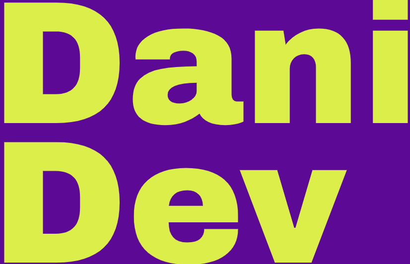

<a name="readme-top"></a>

<div align="center">
  
  <br/>
  <h3><b>README</b></h3>
</div>

<!-- TABLE OF CONTENTS -->

# 📗 Table of Contents

- [📖 About the Project](#about-project)
  - [Kanban Board](#kanban-board)
  - [🛠 Built With](#built-with)
    - [Tech Stack](#tech-stack)
    - [Key Features](#key-features)
  - [🚀 Live Demo](#live-demo)
- [💻 Getting Started](#getting-started)
  - [Prerequisites](#prerequisites)
  - [Setup](#setup)
  - [Install](#install)
  - [Usage](#usage)
  - [Run tests](#run-tests)
  - [Deployment](#deployment)
- [👥 Authors](#authors)
- [🔭 Future Features](#future-features)
- [🤝 Contributing](#contributing)
- [⭐️ Show your support](#support)
- [🙏 Acknowledgements](#acknowledgements)
- [❓ FAQ (OPTIONAL)](#faq)
- [📝 License](#license)

<!-- PROJECT DESCRIPTION -->

# 📖 Reserve a Concert <a name="about-project"></a>

> Would you like to learn more?

**Reserve a Concert** is a web platform where users can create and manage events or concerts, allowing others to book tickets for their events or attend events hosted by others. The frontend of the application is managed in this repository, while the [backend](https://github.com/Diegogagan2587/Book-a-concert-back-end) is powered by an [API built with Ruby on Rails](https://github.com/Diegogagan2587/Book-a-concert-back-end).

### Kanban Board <a id="kanban-board">
- Take a look to the [Project Kanban Board](https://github.com/users/Diegogagan2587/projects/4/views/2)
- Final number of team members: 3
- Kanban Initial state below:

<div align="center">
    
</div>

## 🛠 Built With <a name="built-with"></a>

### Tech Stack <a name="tech-stack"></a>

> Would You like to learn more about the techs we have used so far?

<details>
  <summary>Client</summary>
  <ul>
    <li><a href="https://react.dev/">React</a></li>
    <li><a href="https://ionic.io/ionicons">Ionicons</a></li>
    <li><a href="https://redux.js.org/">Redux</a></li>
    <li><a href="https://redux-toolkit.js.org/">Redux Toolkit</a></li>
    <li><a href="https://react-slick.neostack.com/">React Slick (for Carousel)</a></li>
    <li><a href="https://tailwindcss.com/">Tailwind</a></li>
  </ul>
</details>

<details>
  <summary>Tests</summary>
  <ul>
    <li><a href="https://vitest.dev/guide/">Vitest</a></li>
    <li><a href="https://testing-library.com/docs/react-testing-library/intro/">React Testing Library</a></li>
    <li><a href="https://github.com/jsdom/jsdom">JSDOM</a></li>
    <li><a href="https://mswjs.io/">MSW</a></li>
  </ul>
</details>

<details>
  <summary>Server</summary>
  <ul>
   <li><a href="https://github.com/Diegogagan2587/Book-a-concert-back-end">
   Book-a-concert-api
   </a></li>
  </ul>
</details>

<details>
<summary>Database</summary>
  <ul>
    <li><a href="https://www.postgresql.org/">PostgreSQL</a></li>
  </ul>
</details>

<!-- Features -->

### Key Features <a name="key-features"></a>

> Some Interesting features

- **Any user can create a concert event**
- **The Event organizer can remove or cancel a Concert, and that will cancel all reservations**
- **Any user can book for other user's concert**
- **User can create an account**
- **User can see their current reservations**


<p align="right">(<a href="#readme-top">back to top</a>)</p>

<!-- LIVE DEMO -->

## 🚀 Live Demo <a name="live-demo"></a>


- [Live Demo Link](https://book-a-concert.onrender.com/) -->

<p align="right">(<a href="#readme-top">back to top</a>)</p>

<!-- GETTING STARTED -->

## 💻 Getting Started <a name="getting-started"></a>

> Would you like to make use of this project?

To get a local copy up and running, follow these steps.

### Prerequisites

First Make sure YOu have installed

- [git](https://git-scm.com/)
- [node](https://nodejs.org/en)
- A code editor, the most used is [vscode](https://code.visualstudio.com/) but you can chose any other.

**We do recommend to work on linux**

### Setup

Open you desired folder within you terminal:

```sh
  cd my-folder
```
Then clone the project repository in you current folder

```sh
  git clone git@github.com:Diegogagan2587/Book-a-concert-front-end.git
```

### Install

to install project follow next steps:
 
 1. Open the project folder

```sh
  cd Book-a-concert-front-end
```
2. then install require dependencies:

```sh
npm install
```

3. As the last step, you'll need to create a `.env` file in the
root folder of the project as shown below:
```.env
  //.env

  VITE_API_URL_BASE='http://127.0.0.1:3001'
```
Note: Please make sure that VITE_API_URL_BASE correspond to your desired API base, in this case we are assuming that you have already installed and running the Rails API in local on your computer, if you don't, get it here: 
[Book A Concert - Back End](https://github.com/Diegogagan2587/Book-a-concert-back-end).

Everything should be ready now!

### Usage

To run the project, execute the following command:

```sh
  npm run dev
```

### Run tests

We have implemented test using Vitest, React Testing Library and MSW for mocking
responses from the API. If you would like replicate the settings for our test please refer to 
[Introduction To React Testing](https://www.theodinproject.com/lessons/node-path-react-new-introduction-to-react-testing) 
from [The Oding Project](https://www.theodinproject.com/);

To run tests, run the following command:

```sh
  npm run test
```

### Deployment

You can deploy locally this project using:

```sh
npm run build
```
Don't forget to set up you environmental variables in production:

- `API_URL_BASE = your_api_base_url_here`

<p align="right">(<a href="#readme-top">back to top</a>)</p>

<!-- AUTHORS -->

## 👥 Authors <a name="authors"></a>

> You still here? Let's connect!

👤 **Rudi Carrillo**

- GitHub: [@rudicarrilloypr](https://github.com/rudicarrilloypr)
- Twitter: [@__rudicarrillo](https://twitter.com/__rudicarrillo)
- LinkedIn: [Rudi Carrillo](https://www.linkedin.com/in/rudi-carrillo/)
- Instagram: [@__rudicarrillo](https://www.instagram.com/_rudicarrillo/)

👤 **Diego Vidal Lopez**

- GitHub: [@Diegogagan2587](https://github.com/Diegogagan2587)
- Twitter: [@dieg02587](https://twitter.com/dieg02587)
- LinkedIn: [Diego Vidal Lopez](https://www.linkedin.com/in/diego-vidal2587/)

👤 **Dani Morillo**

- GitHub: [@danifromecuador](https://github.com/danifromecuador)
- Twitter: [@danifromecuador](https://twitter.com/danimorilloc)
- LinkedIn: [danielfromecuador](https://www.linkedin.com/in/danifromec)

<p align="right">(<a href="#readme-top">back to top</a>)</p>

<!-- FUTURE FEATURES -->

## 🔭 Future Features <a name="future-features"></a>

> Some features we might implement:

- [ ] **Cancel a reservation**

<p align="right">(<a href="#readme-top">back to top</a>)</p>

<!-- CONTRIBUTING -->

## 🤝 Contributing <a name="contributing"></a>

Contributions, issues, and feature requests are welcome!

Feel free to check the [issues page](https://github.com/Diegogagan2587/Book-a-concert-front-end/issues).

### Naming branches conventions

Before submitting a pull request please read the original article we based our naming branching conventions [Naming conventions for Git Branches - a Cheatsheet](https://medium.com/@abhay.pixolo/naming-conventions-for-git-branches-a-cheatsheet-8549feca2534) by [Abhay Amin in medium](https://medium.com/@abhay.pixolo). Check some examples with prefixes below:

- `feat/branch-name` branches that implement a new feature or enhancement
- `fix/branch-name` branches that fix a bug
- `docs/branch-name` branches that works on documentation

We are open to other prefixes as long as they are clear and follow general branching conventions. also please note that expect you to submit pull requests from feature branches.

### Commit Conventions

Stick to conventions can bring benefits like better clarity in code reviews, we strive to use the following prefixes in our commits:
- `feat/element` when new functionality is added.
- `fix/element` when a bug on `element` is fixed.
- `chore/` daily task not related to features of errors, like adding elements to `.gitignore` or installing a dependency.
- `test/` if we add or fix a test.
- `docs/` when only documentation is updated.
- `build/` when the change affects only compilation of the project.
- `ci/` Changes that affect continuous integration.
- `style/` Changes that affect code formatting and does not affect functionality.
- `perf/` Changes that affect performance.
- `revert` Automatically implemented by git, but it is used for changes that revert a commit.

### What we value from pull request

We appreciate clean contributions, that highlights main changes, if you plan to format the file, might be good idea to do it in another pull request to make changes that affect functionality easier to read by separate them from those than only affect formatting.


<p align="right">(<a href="#readme-top">back to top</a>)</p>

<!-- SUPPORT -->

## ⭐️ Show your support <a name="support"></a>

Feel free to leave us an star on this repo.

<p align="right">(<a href="#readme-top">back to top</a>)</p>

<!-- ACKNOWLEDGEMENTS -->

## 🙏 Acknowledgments <a name="acknowledgements"></a>

> Learn about people that impact our project:

I'd like to express my gratitude to everyone who made this project possible.

Thanks again to everyone who believed in this project and helped make it a reality!

Furthermore, special recognition is due to [Murat Korkmaz](https://www.behance.net/muratk), the author of this [design](https://www.behance.net/gallery/26425031/Vespa-Responsive-Redesign) that served as inspiration for our work

<p align="right">(<a href="#readme-top">back to top</a>)</p>

<!-- FAQ (optional) -->

## ❓ FAQ (OPTIONAL) <a name="faq"></a>

> Discover some Frequent Ask Questions

- **What if I want to modify this project according to my requirements?**

  - Consider forking the repository, you will get access that way to modify the project and get your own version

- **What if I have a suggestion?**

  - Please visit the Issues Page linked before and submit your suggestion there.

<p align="right">(<a href="#readme-top">back to top</a>)</p>

<!-- LICENSE -->

## 📝 License <a name="license"></a>

This project is [MIT](./LICENSE) licensed.
<p align="right">(<a href="#readme-top">back to top</a>)</p>
