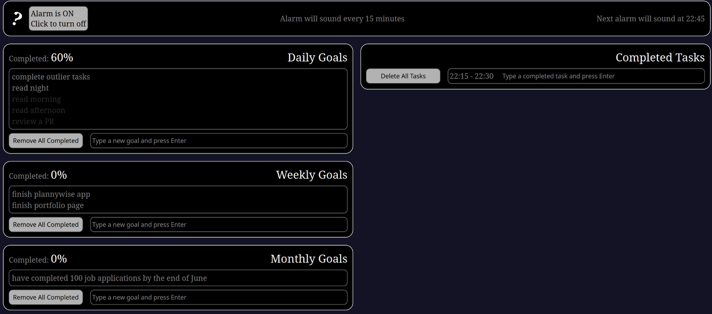

<a name="readme-top"></a>

<div align="center">
  
  <br/>
  <h3><b>README</b></h3>
</div>

<!-- TABLE OF CONTENTS -->

# 📗 Table of Contents

- [📖 About the Project](#about-project)
  - [Overview](#overview)
  - [🛠 Built With](#built-with)
    - [Tech Stack](#tech-stack)
    - [Key Features](#key-features)
  - [🚀 Live Demo](#live-demo)
- [💻 Getting Started](#getting-started)
  - [Prerequisites](#prerequisites)
  - [Setup](#setup)
  - [Install](#install)
  - [Usage](#usage)
  - [Run tests](#run-tests)
  - [Deployment](#deployment)
- [👥 Author](#author)
- [🔭 Future Features](#future-features)
- [🤝 Contributing](#contributing)
- [⭐️ Show your support](#support)
- [🙏 Acknowledgements](#acknowledgements)
- [❓ FAQ (OPTIONAL)](#faq)
- [📝 License](#license)

<!-- PROJECT DESCRIPTION -->

# 📖 PlannyWise App <a name="about-project"></a>

> Would you like to learn more?

**PlannyWise** is a web app to help you to achieve your goals.
Start by creating daily, weekly, and monthly goals. Remember to use SMART goals. Then focus on 15 minutes of work, use Pomodoro technique.
Check your daily, weekly and monthly progress. Remember Kaizen metodology: A one thousand miles travel starts with the first step!.

### Overview <a id="overview">

<div align="center">
    
</div>

## 🛠 Built With <a name="built-with"></a>

### Tech Stack <a name="tech-stack"></a>

> Would You like to learn more about the techs I have used so far?

<details>
  <summary>Client</summary>
  <ul>
    <li><a href="https://react.dev/">React</a></li>
    <li><a href="https://zustand-demo.pmnd.rs/">Zustand</a></li>
  </ul>
</details>

<details>
  <summary>Server</summary>
  <ul>
   <li><a href="https://render.com/">
   Render
   </a></li>
  </ul>
</details>

<!-- Features -->

### Key Features <a name="key-features"></a>

> Some interesting features

- **You don't need to create an account to use this app**
- **Your daily, weekly, and monthly goals are stored in localStorage**
- **The app remembers if a component was shrinked or expanded after a page reload**


<p align="right">(<a href="#readme-top">back to top</a>)</p>

<!-- LIVE DEMO -->

## 🚀 Live Demo <a name="live-demo"></a>


- [Live Demo Link](https://plannywise.onrender.com/) -->

<p align="right">(<a href="#readme-top">back to top</a>)</p>

<!-- GETTING STARTED -->

## 💻 Getting Started <a name="getting-started"></a>

> Would you like to make use of this project?

To get a local copy up and running, follow these steps.

### Prerequisites

First Make sure you have installed

- [git](https://git-scm.com/)
- [node](https://nodejs.org/en)
- A code editor, the most used is [vscode](https://code.visualstudio.com/) but you can chose any other.

**I have been working on linux, but you can install those programs in Windows or Mac**

### Setup

Open you desired folder within you terminal:

```sh
  cd my-folder
```
Then clone the project repository in you current folder

```sh
  git clone git@github.com:danifromecuador/plannywise.git
```

### Install

to install project follow next steps:
 
 1. Open the project folder

```sh
  cd plannywise
```
2. then install require dependencies:

```sh
npm install
```

Everything should be ready now!

### Usage

To run the project, execute the following command:

```sh
  npm run dev
```
And then open a local server on your browser: 
[at this port](http://localhost:5173/)
### Deployment

You can deploy locally this project using:

```sh
npm run build
```


<!-- AUTHOR -->

## 👥 Author <a name="author"></a>

> You still here? Let's connect!

👤 **Dani Morillo**

- GitHub: [@danifromecuador](https://github.com/danifromecuador)
- LinkedIn: [danielfromecuador](https://www.linkedin.com/in/danifromec)
- Linktree: [danifromec](https://linktr.ee/danifromec)

<p align="right">(<a href="#readme-top">back to top</a>)</p>

<!-- FUTURE FEATURES -->

## 🔭 Future Features <a name="future-features"></a>

> Some features I might implement:

- [ ] **Create a user account**

<p align="right">(<a href="#readme-top">back to top</a>)</p>

<!-- CONTRIBUTING -->

## 🤝 Contributing <a name="contributing"></a>

Contributions, issues, and feature requests are welcome!

Feel free to check the [issues page](https://github.com/danifromecuador/plannywise/issues).

### Naming branches conventions

Before submitting a pull request please read the original article we based our naming branching conventions [Naming conventions for Git Branches - a Cheatsheet](https://medium.com/@abhay.pixolo/naming-conventions-for-git-branches-a-cheatsheet-8549feca2534) by [Abhay Amin in medium](https://medium.com/@abhay.pixolo). Check some examples with prefixes below:

- `feat/branch-name` branches that implement a new feature or enhancement
- `fix/branch-name` branches that fix a bug
- `docs/branch-name` branches that works on documentation

I'm open to other prefixes as long as they are clear and follow general branching conventions. also please note that expect you to submit pull requests from feature branches.

### Commit Conventions

Stick to conventions can bring benefits like better clarity in code reviews, we strive to use the following prefixes in our commits:
- `feat/element` when new functionality is added.
- `fix/element` when a bug on `element` is fixed.
- `chore/` daily task not related to features of errors, like adding elements to `.gitignore` or installing a dependency.
- `test/` if we add or fix a test.
- `docs/` when only documentation is updated.
- `build/` when the change affects only compilation of the project.
- `ci/` Changes that affect continuous integration.
- `style/` Changes that affect code formatting and does not affect functionality.
- `perf/` Changes that affect performance.
- `revert` Automatically implemented by git, but it is used for changes that revert a commit.

### What I value from pull request

I appreciate clean contributions, that highlights main changes, if you plan to format the file, might be good idea to do it in another pull request to make changes that affect functionality easier to read by separate them from those than only affect formatting.


<p align="right">(<a href="#readme-top">back to top</a>)</p>

<!-- SUPPORT -->

## ⭐️ Show your support <a name="support"></a>

Feel free to leave an star on [this repo](https://github.com/danifromecuador/plannywise).

<p align="right">(<a href="#readme-top">back to top</a>)</p>

<!-- ACKNOWLEDGEMENTS -->

## 🙏 Acknowledgments <a name="acknowledgements"></a>

I'd like to express my gratitude to everyone who made this project possible.

<p align="right">(<a href="#readme-top">back to top</a>)</p>

<!-- FAQ (optional) -->

## ❓ FAQ (OPTIONAL) <a name="faq"></a>

> Discover some Frequent Ask Questions

- **What if I want to modify the alarm time interval?**

  - That feature will be added in future versions, currently you have to work on 15 minutes intervals

- **What if I have a suggestion?**

  - Please visit the [Issues Page](https://github.com/danifromecuador/plannywise/issues) and submit your suggestion there.

<p align="right">(<a href="#readme-top">back to top</a>)</p>

<!-- LICENSE -->

## 📝 License <a name="license"></a>

This project is [MIT](./LICENSE) licensed.
<p align="right">(<a href="#readme-top">back to top</a>)</p>
